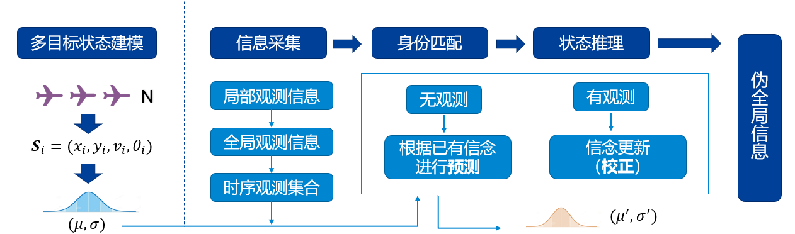
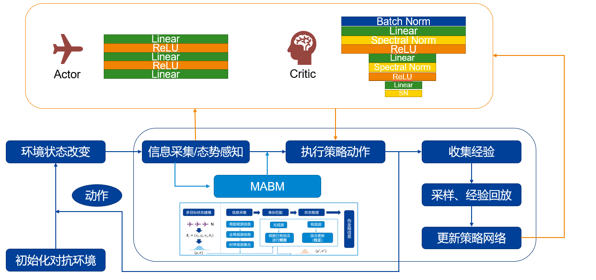
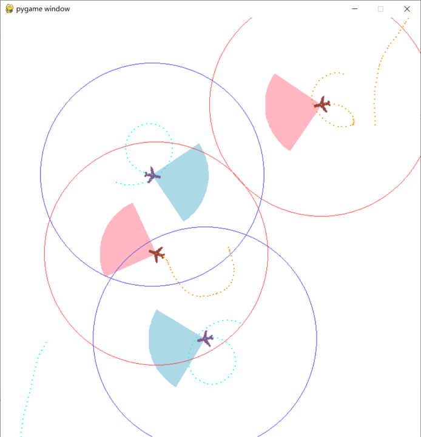
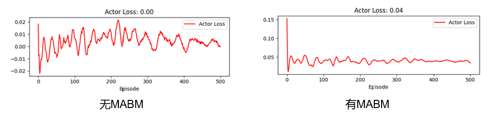
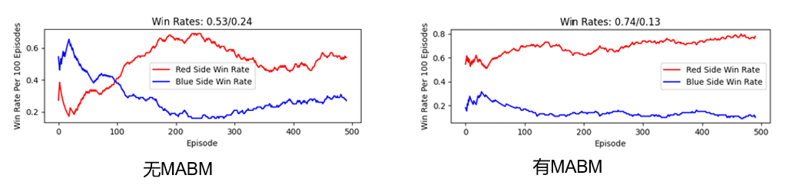

# 非完全信息下无人机集群对抗技术研究

**（Research on UAV Swarm Confrontation Technology under Incomplete Information）**

## 目录
- [项目简介](#项目简介)
- [核心技术](#核心技术)
- [系统实现与环境](#系统实现与环境)
- [实验与成果](#实验与成果)
- [项目价值与展望](#项目价值与展望)

## 项目简介
随着人工智能与航空电子技术的飞速发展，无人机集群正在成为未来自主作战的关键技术路线。本项目聚焦于**非完全信息（Incomplete Information）** 环境下的无人机集群协同对抗问题。

在真实对抗场景中，无人机集群通常只能获取**局部观测信息**，这带来了三大挑战：
1.  **态势感知困难**：仅靠局部信息难以准确判断全局战场态势。
2.  **自主决策挑战**：需要根据实时变化的敌情进行快速、准确的自主决策。
3.  **协同问题**：集群内部各智能体间可能出现策略冲突，影响协同效率。

为应对上述挑战，本项目的核心目标是：**构建一种适用于非完全信息环境的多智能体协同对抗技术框架**，以提升无人机集群在复杂对抗环境下的生存能力与作战效能。

## 核心技术
为了实现这一目标，我们提出了一种融合了**信念推测**与**强化学习**的创新技术框架。该框架主要由两大核心模块组成：

#### 1. MABM (Multi-Agent Belief Model) 信念建模模块
该模块用于解决非完全信息下的态势感知问题。它通过多阶段的信息处理，为每个智能体生成伪全局观测信息，从而提升决策质量。
*   **信息采集**：整合局部观测、全局观测（若有）和时序观测信息。
*   **身份匹配**：采用**匈牙利算法**与**最小代价匹配**，有效处理目标丢失或混淆问题，避免身份错乱。
*   **信念推测**：利用**卡尔曼滤波**对未观测到的敌方单位进行状态估计与预测，弥补信息盲区。
*   **信息输出**：将处理后的信息进行归一化整合，输出伪全局信息，无缝融入下游的决策网络。

  

#### 2. MADDPG (Multi-Agent Deep Deterministic Policy Gradient) 决策算法
作为整体决策框架，我们采用了业界前沿的**多智能体深度确定性策略梯度算法（MADDPG）**。该算法属于一种基于Actor-Critic框架的强化学习算法，特别适用于处理连续动作空间的问题。

*   **集中式训练，分布式执行**：在训练阶段，Critic网络可以获取全局信息（由MABM提供）来指导Actor网络学习；在执行阶段，每个Actor仅依赖自身观测进行决策。
*   **多智能体协同**：有效解决多智能体环境下的非平稳性问题，促进了智能体之间的协同。
*   **结合MABM**：我们将MABM模块生成的伪全局观测信息作为Actor网络的一部分输入，显著增强了其在非完全信息环境下的决策能力。

  

## 系统实现与环境
为了验证我们提出的技术框架，我们从零开始搭建了一个功能完善的二维平面无人机对抗仿真平台。

*   **仿真平台**：基于`Pygame`开发，支持红蓝双方集群的实时对抗。
*   **环境特性**：
    *   **动力学模拟**：精确模拟无人机的运动学与动力学特性。
    *   **多智能体特性**：支持局部观测、连续动作空间以及复杂的敌我交互。
    *   **强化学习接口**：为强化学习算法提供了丰富的对抗反馈信号和标准的交互接口。
*   **对抗场景**：
    *   **区域压制模式**：鼓励智能体进行编队控制与协同配合。
    *   **射击打击模式**：鼓励智能体高效率地歼灭敌方目标。

  

## 实验与成果
我们通过一系列对比实验，充分验证了所提框架的有效性。

#### 关键成果
1.  **网络收敛性与效率**：实验结果表明，加入MABM模块后，Actor网络的损失（Loss）更低且收敛更快，证明了模型的学习效率和稳定性得到了提升。

  

2.  **胜率显著提升**：与不使用MABM的基线模型相比，搭载MABM的智能体胜率得到了大幅提升。在有环境扰动（如高斯噪声、数据丢包）的复杂场景下，优势尤为明显。
    *   **平均胜率提升**：在相似环境下，正方（红方）平均胜率提升了**39%**，反方（蓝方）胜率相应降低了**37%**。

  

| 对抗模式 | 红方胜率 (无MABM) | 蓝方胜率 (无MABM) | 红方胜率 (有MABM) | 蓝方胜率 (有MABM) |
| :--- | :---: | :---: | :---: | :---: |
| **射击打击模式** | 0.66 | 0.15 | **0.81** | 0.09 |
| **区域压制模式** | 0.53 | 0.24 | **0.74** | 0.13 |

## 项目价值与展望

#### 研究优势与创新
*   **融合信念推理与强化学习**：将信念推测机制与多智能体强化学习训练过程深度融合。
*   **模块化结构**：引入“卡尔曼预测 + 贝叶斯更新 + 目标匹配”的模块化结构，思路清晰，易于扩展。
*   **通用决策框架**：提供了一套通用的“观测-建模-决策”流程框架，具备良好的可扩展性。

#### 未来工作展望
*   **增强时序建模**：引入记忆网络（如LSTM, Transformer）以增强对时序信息的处理能力。
*   **提升策略泛化**：尝试引入迁移学习与对抗训练，进一步提升模型在多变环境下的泛化能力。
*   **探索现实部署**：将该策略引擎应用于真实无人机平台或多场景通用策略中，探索其在现实世界中的应用潜力。
